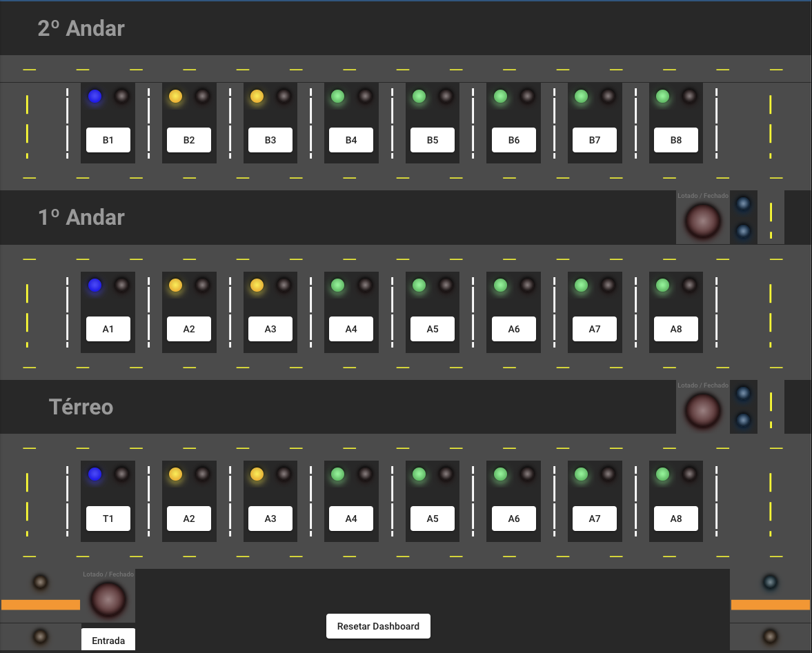
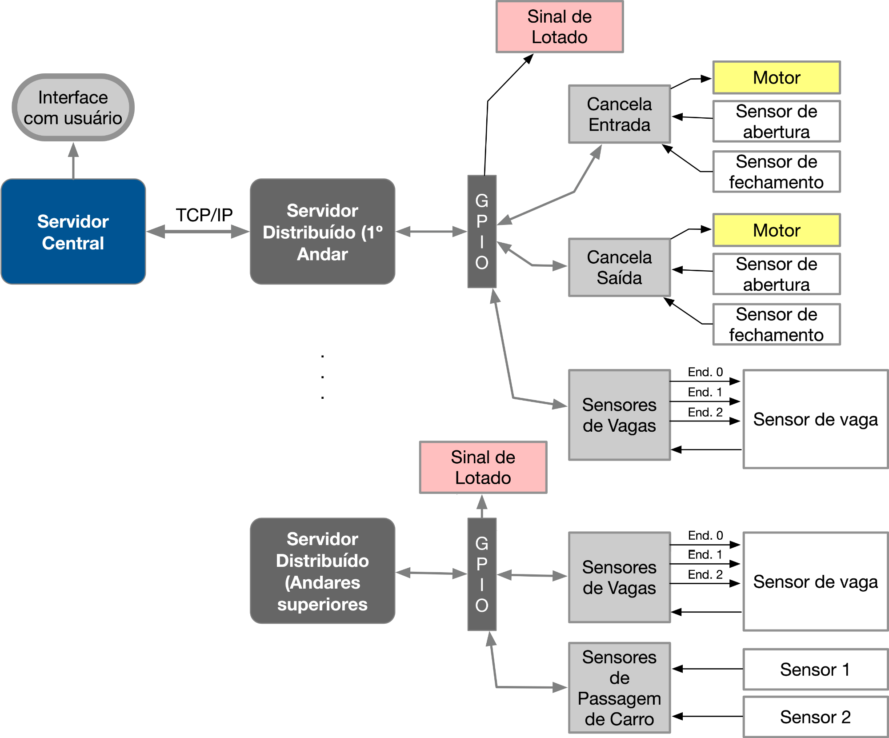

# Trabalho 1 (2024/1)

<details>
  <summary> Enunciado </summary>
Trabalho 1 da disciplina de Fundamentos de Sistemas Embarcados (2024/1)

## 1. Objetivos

Este trabalho tem por objetivo a criação de um sistema distribuído para o controle e monitoramento de estacionamentos comerciais. Dentre os itens controlados teremos a entrada e saída de veículos, a ocupação de cada vaga individualmente, a ocupação do estacionamento como um todo e a cobrança por tempo de permanência.

|                                                       Cancela                                                       |                                          Sinalização de Vagas                                           |                                                                  Panel Geral                                                                  |
| :-----------------------------------------------------------------------------------------------------------------: | :-----------------------------------------------------------------------------------------------------: | :-------------------------------------------------------------------------------------------------------------------------------------------: |
|  |  |  |

O sistema deve ser desenvolvido para funcionar em um conjunto de placas Raspberry Pi com um **_servidor central_** responsável pelo controle e interface com o usuário e **_servidores distribuídos_** para o controle de todos os sensores e atuadores de cada andar do estacionamento.

Para simplificar a implementação, uma versão reduzida de um estacionamento com dois andares foi criada e é apresentada na Figura 1.



Obs.: Vagas sinalizadas em **VERDE** são **regulares**, em **AZUL** de **portadores de necessidades especiais** e **AMARELO** para **idosos**.

Composição dos sensores e atuadores do sistema:

### Térreo:

- **Cancela de entrada**: um **botão** irá simular a chegada de uma carro, o **sensor de prenseça** indica a presença do carro aguardando a cancela abrir, a **cancela** e um **sensor de passagem** indicando que a cancela pode ser fechada;
- **Sinal de lotado** (Led vermelho): indicando quando o estacionamento está cheio;
- **Cancela de saída**: **sensor de prenseça** indicando a presença do carro aguardando a cancela abrir, a **cancela** e um **sensor de passagem** indicando que a cancela pode ser fechada;
- **8 vagas** com sensores indicando a ocupação da vaga e um botão para remover o carro;

### 1º e 2º Andar:

- **8 vagas** com sensores indicando a ocupação da vaga e um botão para remover o carro;
- **Sinal de lotado** (Led vermelho): indicando quando o andar está lotado;
- Dois sensores que indicam a **passagem de veículos** entre os andares.

Cada andar deve ser controlado por um **processo** individual que esteja rodando em uma placa Raspberry Pi e cada controlador de andar deve se comunicar via rede (TCP/IP) com o servidor central.

Na Figura 2 é possível ver a arquitetura do sistema.



## 2. Componentes do Sistema e Conexões entre os módulos do sistema

Para simplificar a implementação e logística de testes do trabalho, a quantidade de andares será limitada a 3 e o trabalho poderá ser desenvolvido em um única placa Raspberry Pi que simula os 3 andares, mesmo assim, cada andar deve ser controlado por um processo separado. O Servidor Central poderá ser executado em qualquer uma das placas.

1. Os servidores distribuídos deverão se comunicar com o servidor central através do Protocolo TCP/IP (O formato das mensagens ficam à cargo do aluno. A sugestão é o uso do formato JSON);
2. Cada instância do servidor distribuído (uma por andar) deve rodar em um processo paralelo em portas distintas em cada uma das duas placas Raspberry Pi;
3. Cada entrada / saída está representada na Tabela 1. Cada servidor distribuído é responsável pelo controle de um andar.

<center>
<b>Tabela 1</b> - Pinout da GPIO da Raspberry Pi do <b>Andar Térreo</b>
</center>
<center>

| Item                              | GPIO | Direção |
| --------------------------------- | :--: | :-----: |
| ENDERECO_01                       |  22  |  Saída  |
| ENDERECO_02                       |  26  |  Saída  |
| ENDERECO_03                       |  19  |  Saída  |
| SENSOR_DE_VAGA                    |  18  | Entrada |
| SINAL_DE_LOTADO_FECHADO           |  27  |  Saída  |
| SENSOR_ABERTURA_CANCELA_ENTRADA   |  23  | Entrada |
| SENSOR_FECHAMENTO_CANCELA_ENTRADA |  24  | Entrada |
| MOTOR_CANCELA_ENTRADA             |  10  |  Saída  |
| SENSOR_ABERTURA_CANCELA_SAIDA     |  25  | Entrada |
| SENSOR_FECHAMENTO_CANCELA_SAIDA   |  12  | Entrada |
| MOTOR_CANCELA_SAIDA               |  17  |  Saída  |

</center>

<center>
<b>Tabela 2</b> - Pinout da GPIO da Raspberry Pi do <b>1º Andar</b>
</center>
<center>

| Item                    | GPIO | Direção |
| ----------------------- | :--: | :-----: |
| ENDERECO_01             |  13  |  Saída  |
| ENDERECO_02             |  06  |  Saída  |
| ENDERECO_03             |  05  |  Saída  |
| SENSOR_DE_VAGA          |  20  | Entrada |
| SINAL_DE_LOTADO_FECHADO |  08  |  Saída  |
| SENSOR_DE_PASSAGEM_1    |  16  | Entrada |
| SENSOR_DE_PASSAGEM_2    |  21  | Entrada |

</center>

<center>
<b>Tabela 3</b> - Pinout da GPIO da Raspberry Pi do <b>2º Andar</b>
</center>
<center>

| Item                    | GPIO | Direção |
| ----------------------- | :--: | :-----: |
| ENDERECO_01             |  09  |  Saída  |
| ENDERECO_02             |  11  |  Saída  |
| ENDERECO_03             |  15  |  Saída  |
| SENSOR_DE_VAGA          |  01  | Entrada |
| SINAL_DE_LOTADO_FECHADO |  14  |  Saída  |
| SENSOR_DE_PASSAGEM_1    |  0   | Entrada |
| SENSOR_DE_PASSAGEM_2    |  07  | Entrada |

</center>

[Link do Dashboard - Estacionamento 1](http://164.41.98.25:443/dashboard/84202ac0-08b8-11ef-80f6-3d6020ac4f91?publicId=ba042a80-0322-11ed-9f25-414fbaf2b065)

[Link do Dashboard - Estacionamento 2](http://164.41.98.25:443/dashboard/b4ca1230-0291-11ef-80f6-3d6020ac4f91?publicId=ba042a80-0322-11ed-9f25-414fbaf2b065)

[Link do Dashboard - Estacionamento 3](http://164.41.98.25:443/dashboard/014e1b50-03d8-11ef-80f6-3d6020ac4f91?publicId=ba042a80-0322-11ed-9f25-414fbaf2b065)

[Link do Dashboard - Estacionamento 4](http://164.41.98.25:443/dashboard/9466dad0-0e3c-11ef-80f6-3d6020ac4f91?publicId=ba042a80-0322-11ed-9f25-414fbaf2b065)

[Link do Dashboard - Estacionamento 5](http://164.41.98.25:443/dashboard/0b66ffa0-0d7c-11ef-80f6-3d6020ac4f91?publicId=ba042a80-0322-11ed-9f25-414fbaf2b065)

[Link do Dashboard - Estacionamento 6](http://164.41.98.25:443/dashboard/65a836d0-0437-11ef-80f6-3d6020ac4f91?publicId=ba042a80-0322-11ed-9f25-414fbaf2b065)

[Link do Dashboard - Estacionamento 7](http://164.41.98.25:443/dashboard/52882a50-0be0-11ef-80f6-3d6020ac4f91?publicId=ba042a80-0322-11ed-9f25-414fbaf2b065)

## 3. Funcionamento e Requisitos

O controle do estacionamento deverá funcionar da seguine maneira:

1. A entrada de um novo carro é acionada através do botão **Entrada**. Ao ser pressionado um carro chega à Cancela de Entrada e aciona o **Sensor de Abertura da Cancela de Entrada**;
2. Ao detectar um novo carro na **Cancela de Entrada**, o sistema deverá registrar a entrada do carro (Data/hora), gerar um **Identificador** e em seguida acionar o **Motor da Cancela de Entrada**;
3. Ao abrir a cancela, o carro irá automaticamente entrar a acionar o **Sensor de Fechamento da Cancela de Entrada**. Neste momento o sistema deve detectar este evento e **fechar a cancela de entrada**;
4. O carro irá prosseguir selecionando uma vaga disponível automaticamente (em qualquer um dos andares). Ao estacionar, o sensor de vaga será acionado e deve ser lido para registrar em que posição o carro estacionou, associado o Identificador à esta posição;
5. É necessário que o sistema faça a leitura periódica de todos os sensores de vaga, para isto, é necessário efetuar uma varredura em cada endereço (0 a 7) acionando as saídas da GPIO correspondentes e, para cada endereço, lendo o sinal do **Sensor de Vaga**;
6. Caso o carro escolha o 1º ou 2º Andar, os sensores de passagem serão acionados com um sinal "quadrado" ou um "pulso" de aprox. 100 a 300 ms de largura (Isso significa que cada sensor de passagem irá do valor 0 para 1 e ficará em 1 durante esse período, em seguida retornando para 0). O acionamento dos sensores de passagem ocorrerá na seguinte sequência:
   1. Sensor de Passagem 1 seguido do 2: indica um carro que **sobe** do próximo andar superior;
   2. Sensor de Passagem 2 seguido do 1: indica um carro que **desce** do próximo andar inferior;
7. Ao clicar no botão de uma vaga ocupada, o respectivo carro irá se direcionar à **Cancela de Saída** ativando o **Sensor de Abertura da Cancela de Saída**. Caso o carro esteja no 1º ou 2º Andar, irá acionar primeiro os sensores de passagem para depois ir à cancela;
8. Ao detectar um novo carro na **Cancela de Saída**, o sistema deverá registrar a saída do carro (Data/hora) e **contabilizar o valor total pago**, e em seguida acionar o **Motor da Cancela de Saída**;
9. Ao abrir a cancela, o carro irá automaticamente sair a acionar o **Sensor de Fechamento da Cancela de Saída**. Neste momento o sistema deve detectar este evento e **fechar a cancela de saída**;
10. Por fim, deverá haver um controle do número de veículos em cada andar e no estacionamento como um todo.
    1. Em caso de **Estacionamento Lotado**, a luz indicadora de Lotação deverá ser acionada.
    2. Em caso de **lotação do 1º ou 2º Andar**, a luz indicadora de Lotação deverá ser acionada.

O sistema de controle possui os seguintes requisitos:

### **3.1 Servidores Distribuídos**

O código do Servidor Distribuído deve ser desenvolvido em **Python**, **C**/**C++** ou **Rust**;

Os servidores distribuídos tem as seguintes responsabilidades:

1. Leitura periódica da ocupação de vagas enviando as mudanças de estado ao servidor central;
2. **Térreo**: Controle da cancela: abrir e fechar a cancela de acordo com a presença de um carro na espera.
   1. **Cancela de entrada**: ao registar a passagem do carro, enviar mensagem ao **Servidor Cental** para o registro da data/hora da entrada;
   2. **Cancela de saída**: ao registar a passagem do carro, enviar mensagem ao **Servidor Cental** para o registro da data/hora da saída para a contabilização da cobraça;
3. Acionar o sinal de Lotado/Fechado de acordo com um comando vindo do **Servidor Central**;
4. **1º e 2º Andar** detectar a passagem de carros pelos **sensores de passagem** informando o **Servidor Central** de subida ou descida de carros de um andar para o outro;

### **3.2 Servidor Central**

O código do Servidor Central pode ser desenvolvido em **Python**, **C**/**C++** ou **Rust**. Em qualquer uma das linguagens devem haver instruções explicitas de como instalar e rodar. Para C/C++ basta o Makefile e incluir todas as dependências no próprio projeto.

O servidor central tem as seguintes responsabilidades:

1. Manter conexão com os servidores distribuídos (TCP/IP);
2. Prover uma **interface de usuário** que mantenham atualizadas as seguintes informações:  
   a. **Número de carros em cada andar** (Não necessariamente nas vagas, um carro pode estar a caminho da vaga);  
   b. **Número total de carros no estacionamento**;  
   c. **Número de Vagas disponíveis em cada andar (Por Tipo: regular, deficiente ou idoso)**;  
   d. **Valor total pago**: O valor a ser pago deverá ser proporcional aos minutos estacionados. A **taxa por minuto** deve ser **R$ 0,10** (dez centavos por minuto);
3. Prover **mecanismo na interface** para:  
   a. **Fechar o estacionamento**:
   1. **Manualmente**: à partir de um comando de usuário **ativar/desativar** o sinal de **Lotado/Fechado**;
   2. **Automaticamente**: à partir da contagem e lotação total das vagas de todos os andares, **ativar/destivar** o sinal de **Lotado/Fechado**;  
      b. **Bloquear o 1º e/ou 2º Andar**:
   3. mesmo sem estar com todas as vagas ocupadas, sinalizar o impedimento ao 2º Andar ativando o "Sinal de Lotado";

### **3.3 Geral**

1. Os códigos em C/C++ devem possuir Makefile para compilação;
2. Cada serviço (programa) deve poder ser iniciado independente dos demais e ficar aguardando o acionamento dos demais, re-estabelecento sua conexão TCP/IP assim que os serviços voltem ao ar em qualquer ordem;
3. Deverá haver um arquivo README no repositório descrevento o modo de instalação/execução e o modo de uso do programa.

### 3.4. Observações sobre a implementação

1. **Sensor de Passagem**: conforme descrito no item 3, há dois sensores de passagem que funcionam em conjunto para sinalizar a passagem de veículos de um andar para o outro. Os sensores emitem um "pulso" ou "sinal quadrado" no formato \_|‾‾‾|\_. Este sinal deve ser detectado a partir da borda de subida e descida e a largura do pulso tem duração entre 100 a 300 ms dependendo da velocidade com que o carro passa pelo sensor. A ordem de acionamento dos sensores indica a direção em que o carro passa da seguinte maneira:
   1. Sensor de Passagem 1 seguido do 2: indica um carro que **sobe** para o próximo andar superior;
   2. Sensor de Passagem 2 seguido do 1: indica um carro que **desce** para o próximo andar inferior;

## 4. Entrega e Critérios de Avaliação

### Entrega:

1. Repositório (no Github Classroom) incluindo o README com as instruções de execução (Para projetos em C/C++ é necessário incluir o Makefile);
2. Vídeo de aprox. 5 min mostrando o sistema em funcionamento (Mostrando o funcionamento em si e destacar partes do código fonte mais importantes).

A avaliação será realizada seguindo os seguintes critérios:

<center>
Tabela 4 - Tabela de Avaliação
</center>

| ITEM                               | DETALHE                                                                                                                                            | VALOR |
| ---------------------------------- | -------------------------------------------------------------------------------------------------------------------------------------------------- | :---: |
| **Servidor Central**               |                                                                                                                                                    |       |
| **Interface (Monitoramento)**      | Interface gráfica (via terminal, web, etc) apresentando os dados descritos no item 3.2.                                                            |  1,0  |
| **Interface (Comandos)**           | Mecanismo de acionar manualmente os modos descritos no item 3.2.                                                                                   |  1,0  |
| **Monitoramento das Vagas**        | Contabilização correta de vagas individualmente e por andar, e sinalização de lotação (Geral e por andar).                                         |  1,0  |
| **Contabilização de Pagamentos**   | Correta cobrança de ocupação do estacionamento por minuto.                                                                                         |  1,0  |
| **Servidores Distribuídos**        |                                                                                                                                                    |       |
| **Monitoramento das Vagas**        | Detecção de ocupação de vagas individualmente.                                                                                                     |  1,0  |
| **Controle das Cancelas**          | Detecção de presença de carros, aguardando, abertura e fechamento correto das cancelas.                                                            |  1,0  |
| **Sensor de Passagem de Carros**   | Detecção da passagem de carros entre os andares indentificando a direção.                                                                          |  1,0  |
| **Geral**                          |                                                                                                                                                    |       |
| **Comunicação TCP/IP**             | Correta implementação de comunicação entre os servidores usando o protocolo TCP/IP. Re-estabelecimento de conexão caso qualquer dos serviços caia. |  1,0  |
| **Persistência dos serviços**      | Conexão automática entre os serviços (independente da ordem de inicialização) e re-estabelecimento de conexão caso qualquer dos serviços caia.     |  1,0  |
| **Qualidade do Código / Execução** | Utilização de boas práticas como o uso de bons nomes, modularização e organização em geral, bom desempenho da aplicação sem muito uso da CPU.      |  1,5  |
| **Pontuação Extra**                | Qualidade e usabilidade acima da média.                                                                                                            |  0,5  |

## 5. Referências

### Bibliotecas em Python

- gpiozero (https://gpiozero.readthedocs.io)
- RPi.GPIO (https://pypi.org/project/RPi.GPIO/)

A documentação da RPi.GPIO se encontra em
https://sourceforge.net/p/raspberry-gpio-python/wiki/Examples/

### Bibliotecas em C/C++

- WiringPi (http://wiringpi.com/)
- BCM2835 (http://www.airspayce.com/mikem/bcm2835/)
- PiGPIO (http://abyz.me.uk/rpi/pigpio/index.html)
- sysfs (https://elinux.org/RPi_GPIO_Code_Samples)

### Lista de Exemplos

Há um compilado de exemplos de acesso à GPIO em várias linguages de programação como C, C#, Ruby, Perl, Python, Java e Shell (https://elinux.org/RPi_GPIO_Code_Samples).

</details>

<br/>
<details>
  <summary> README entregue </summary>

## Instalação de dependencias

### Makefile

Para instalar as dependencias com makefile

1. Certifique-se de ter o `python3 venv` instalado
2. Execute na pasta raiz:

```bash
make venv
```

### Manualmente

Para instalar dependencias manualmente:

```bash
pip3 install -r requirements.txt
```

## Execução

Com makefile:

```bash
make run
```

Sem makefile:

```bash
python3 src/main.py
```

## Apresentação

Nossa apresentação se encontra em https://github.com/FGA-FSE/trabalho-1-estacionamentos-trabalho-de-fse/blob/main/apresentacao.mp4

## Autores

| **Matricula** | **Aluno**                       |
| :------------ | :------------------------------ |
| 211043683     | Marcus Vinicius Paiva Martins   |
| 180042238     | João Gabriel de Campos de Matos |

<br/> <br/>

[](https://classroom.github.com/a/SmCo-Bsf)

</details>
<br/>
<details open>
  <summary> Nota da entrega </summary>

| ITEM                               | DETALHE                                                                                                                                            | PESO  | Nota | Obs                                                                                                                                                                                                                                                                                                                                                                                                                                                                                                                                                                                                                                                                                                                                                                                                                                                                                                    |
| ---------------------------------- | -------------------------------------------------------------------------------------------------------------------------------------------------- | :---: | ---- | ------------------------------------------------------------------------------------------------------------------------------------------------------------------------------------------------------------------------------------------------------------------------------------------------------------------------------------------------------------------------------------------------------------------------------------------------------------------------------------------------------------------------------------------------------------------------------------------------------------------------------------------------------------------------------------------------------------------------------------------------------------------------------------------------------------------------------------------------------------------------------------------------------ |
| **Servidor Central**               |                                                                                                                                                    |       |      |                                                                                                                                                                                                                                                                                                                                                                                                                                                                                                                                                                                                                                                                                                                                                                                                                                                                                                        |
| **Interface (Monitoramento)**      | Interface gráfica (via terminal, web, etc) apresentando os dados descritos no item 3.2.                                                            |  1,0  | 0    | - Número de carros em cada andar: Não apresenta essa informação- Número total de carros no estacionamento: Não apresenta essa informação- Número de vagas disponíveis em cada andar (Por Tipo: regular, deficiente ou idoso): Não apresenta essa informação- Valor total pago: Não apresenta essa informaçãoO projeto possui apresenta as seguintes informações:Estado Atual do Estacionamento:Total de carros: 0Terreo: Carros: 0, Vagas disponíveis: 8, Pagamentos: R$0.00Primeiro: Carros: 0, Vagas disponíveis: 8, Pagamentos: R$0.00Segundo: Carros: 0, Vagas disponíveis: 8, Pagamentos: R$0.00Valor total pago: R$0.00Status Lotado: NãoBloqueio Primeiro Andar: NãoBloqueio Segundo Andar: NãoMas elas só aparecem uma vez, quando a aplicação é iniciada e depois nunca mais aparece ou é atualizada. Também não foi apresentado uma opção no menu para exibir essas informações atualizadas. |
| **Interface (Comandos)**           | Mecanismo de acionar manualmente os modos descritos no item 3.2.                                                                                   |  1,0  | 0    | Mecanismo não funcionou. No menu implementado no arquivo main.py linhas 88-97, o comando digitado é lido, mas nada é feito depois disso                                                                                                                                                                                                                                                                                                                                                                                                                                                                                                                                                                                                                                                                                                                                                                |
| **Monitoramento das Vagas**        | Contabilização correta de vagas individualmente e por andar, e sinalização de lotação (Geral e por andar).                                         |  1,0  | 0,5  | - Contabilização correta de vagas individualmente e por andar: Não apresenta essa informação- Sinalização de lotação (Geral e por andar): OK                                                                                                                                                                                                                                                                                                                                                                                                                                                                                                                                                                                                                                                                                                                                                           |
| **Contabilização de Pagamentos**   | Correta cobrança de ocupação do estacionamento por minuto.                                                                                         |  1,0  | 0    | Não implementado                                                                                                                                                                                                                                                                                                                                                                                                                                                                                                                                                                                                                                                                                                                                                                                                                                                                                       |
|  |
| **Servidores Distribuídos**        |                                                                                                                                                    |       |      |                                                                                                                                                                                                                                                                                                                                                                                                                                                                                                                                                                                                                                                                                                                                                                                                                                                                                                        |
| **Monitoramento das Vagas**        | Detecção de ocupação de vagas individualmente.                                                                                                     |  1,0  | 0,5  | Não é exibido ou apresentado uma opção que mostre o estado de ocupação das vagas. A única informação que aparece é quando uma vaga é ocupada, daí é exibido um log no terminal informando "Ocupou a vaga A5", por exemplo. Mas se a vaga é liberada, não exibe um log informando que foi liberada.                                                                                                                                                                                                                                                                                                                                                                                                                                                                                                                                                                                                     |
| **Controle das Cancelas**          | Detecção de presença de carros, aguardando, abertura e fechamento correto das cancelas.                                                            |  1,0  | 1,0  | Ok                                                                                                                                                                                                                                                                                                                                                                                                                                                                                                                                                                                                                                                                                                                                                                                                                                                                                                     |
| **Sensor de Passagem de Carros**   | Detecção da passagem de carros entre os andares indentificando a direção.                                                                          |  1,0  | 1,0  | Ok                                                                                                                                                                                                                                                                                                                                                                                                                                                                                                                                                                                                                                                                                                                                                                                                                                                                                                     |
| **Geral**                          |                                                                                                                                                    |       |      |                                                                                                                                                                                                                                                                                                                                                                                                                                                                                                                                                                                                                                                                                                                                                                                                                                                                                                        |
| **Comunicação TCP/IP**             | Correta implementação de comunicação entre os servidores usando o protocolo TCP/IP. Re-estabelecimento de conexão caso qualquer dos serviços caia. |  1,0  | 0    | - O projeto só possui um executável chamado main.py. Nele, é executado tanto o servidor central quanto o distribuido. A proposta de arquitetura desse projeto (Figura 2 - readme do projeto) evidência que cada instância do servidor distribuído (uma por andar) deve rodar em um processo paralelo em portas distintas em cada uma das placas Raspberry Pi. O que não é possível de ser feito com o projeto fornecido.                                                                                                                                                                                                                                                                                                                                                                                                                                                                               |
| **Persistência dos serviços**      | Conexão automática entre os serviços (independente da ordem de inicialização) e re-estabelecimento de conexão caso qualquer dos serviços caia.     |  1,0  | 0,5  | Os serviços criados (threads) conseguem se conectar. Porém, não foi seguido a proposta de arquitetura do projeto (Figura 2)                                                                                                                                                                                                                                                                                                                                                                                                                                                                                                                                                                                                                                                                                                                                                                            |
| **Qualidade do Código / Execução** | Utilização de boas práticas como o uso de bons nomes, modularização e organização em geral, bom desempenho da aplicação sem muito uso da CPU.      |  1,5  | 0,5  | - Ao executar o comando "python3 src/main.py", o seguinte erro é apresentado: line 215, in cancela_entrada.start() File "/usr/lib/python3.9/multiprocessing/process.py", line 115, in start assert self.\_popen is None, 'cannot start a process twice' AssertionError: cannot start a process twiceIsso aconteceu porque no arquivo main.py há código duplicado que está tentando iniciar a mesma thread mais de uma vez. Precisei comentar o código da linha 215 a linha 227 do arquivo main.py [-0,5]Depois disso, o código conseguiu compilar e executar. - O consumo de CPU desse projeto está variando entre 98.2% e 100%, evidenciando um alto consumo de processamento [-0,5]                                                                                                                                                                                                                  |
| **Pontuação Extra**                | Qualidade e usabilidade acima da média.                                                                                                            |  0,5  | 0    | Projeto possui erros de qualidade (alto consumo de cpu, arquitetura incorreta) e usabilidade (menu não funciona, não atualiza as informações)                                                                                                                                                                                                                                                                                                                                                                                                                                                                                                                                                                                                                                                                                                                                                          |
|                                    |                                                                                                                                                    | Total | 4,0  |                                                                                                                                                                                                                                                                                                                                                                                                                                                                                                                                                                                                                                                                                                                                                                                                                                                                                                        |

</details>
