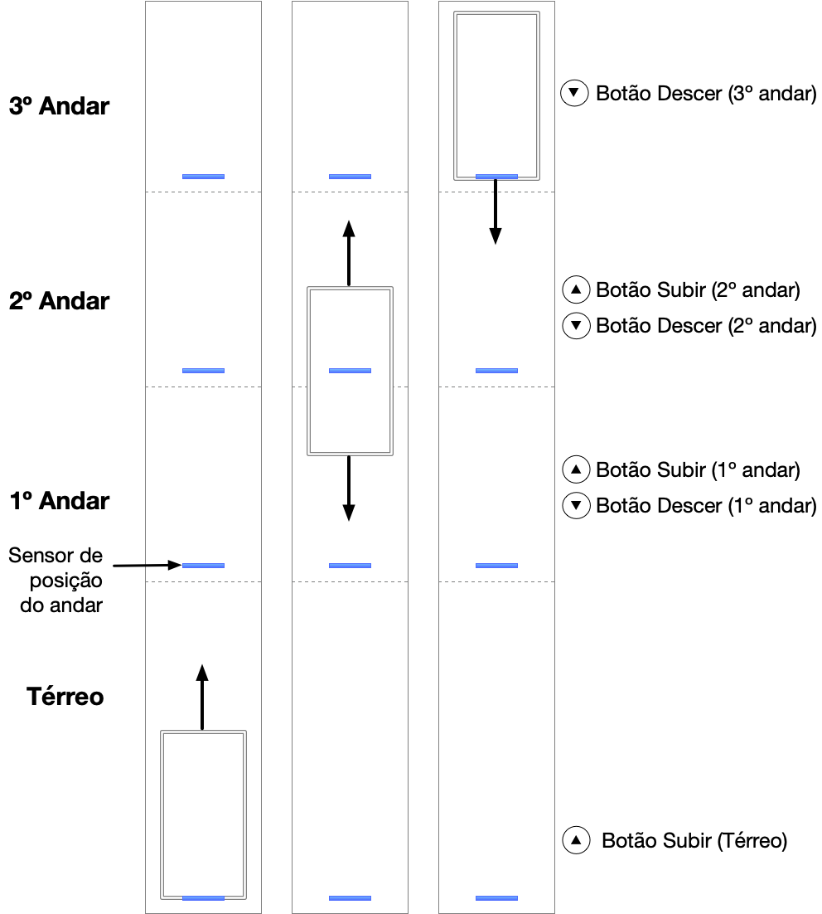
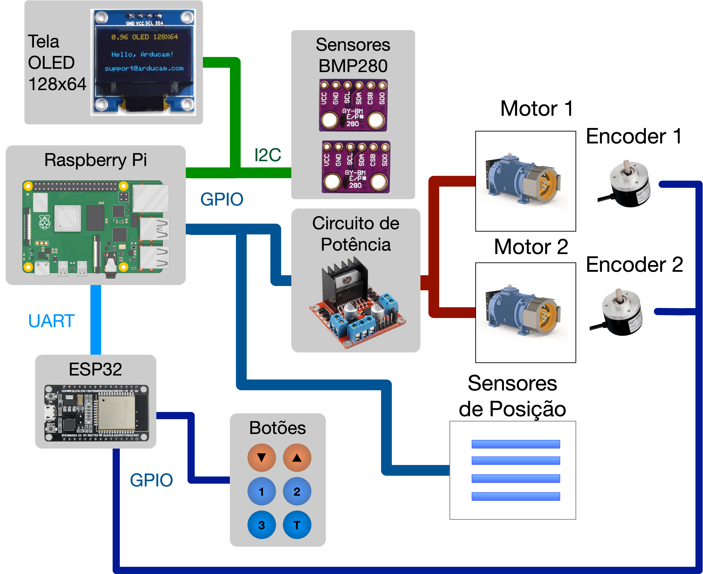

# Trabalho 2 (2024/1)

<details>
  <summary> Enunciado </summary>

# Trabalho 2 - 2024/1

Trabalho 2 da disciplina de Fundamentos de Sistemas Embarcados (2024/1)

## 1. Objetivos

|                                                                                                                                       Trilhos do Elevador                                                                                                                                        |                                         Painel de Controle                                          |                                                                           Elevadores                                                                           |
| :----------------------------------------------------------------------------------------------------------------------------------------------------------------------------------------------------------------------------------------------------------------------------------------------: | :-------------------------------------------------------------------------------------------------: | :------------------------------------------------------------------------------------------------------------------------------------------------------------: |
|  |  |  |

O trabalho envolve o desenvolvimento do software que efetua o controle completo de um sistema de elevadores prediais incluindo o controle de movimentação, acionamento dos botões internos e externos e monitoramento de temperatura. O movimento dos elevadores é controlado à partir de motores elétricos e a posição é sinalizada à partir de sensores de posição e encoders.

O controle dos elevadores deve responder aos comandos dos usuários por meio de botões externos (andares) ou internos (painel de botões dos elevadores).

**Botões de Entrada**

- Painel Interno (Térreo, 1º Andar, 2º Andar, 3º Andar, Emergência)
- Andares (Sobe e/ou Desce)

## 2. Componentes do Sistema

O sistema como um todo é composto por:

- 02 Elevadores controlados pelos motores e monitorados por sensores;
- 04 Sensores de posição dos andares para cada elevador;
- 02 Sensores BMP280 (I2C) para a medição da temperatura interna de cada elevador;
- 01 módulo Display OLED 0.96" 128x64 SSD1306 com circuito I2C integrado;
- 01 Conversor lógico bidirecional (3.3V / 5V);
- 01 Driver de potência para acionamento dos motores;
- 01 ESP32;
- 01 Raspberry Pi 4;



## 3. Conexões entre os módulos do sistema

1. Os sensores de temperatura BMP280 estão ligados ao barramento I2C e utilizam os endereços `0x76` e `0x77`, respectivamente para os Elevadores 1 e 2;
2. O Encoder Digital de cada elevador mede a posição do motor e estará ligado à ESP32.
3. Os sensores de posição dos andares estão ligados diretamente à portas GPIO da Raspberry Pi;
4. Os motores e os pinos de direção de cada motor estão ambos ligados às portas GPIO e são acionados através do circuito de potência;
5. A ESP32 está conectada à placa Raspberry Pi via UART (Protocolo MODBUS-RTU);
6. Os botões estão ligados à GPIO da ESP32 e os comandos são transmitidos à Raspberry Pi via UART;
7. Os comandos de acionamento (alternativamente) virão do Dashboard (Thingsboard) via UART através da ESP32;

<br>

<p style="text-align: left;">Pinos da GPIO (BCM) Raspberry Pi</p>

| Sensor                                   | Elevador 1 GPIO (BCM) | Elevador 2 GPIO (BCM) |
| :--------------------------------------- | :-------------------: | :-------------------: |
| `DIR1` - Direção 1                       |          20           |          19           |
| `DIR2` - Direção 2                       |          21           |          26           |
| `POTM` - Potência do Motor (PWM)         |          12           |          13           |
| `Sensor_Terreo` - Sensor do andar térreo |          18           |          17           |
| `Sensor_1_andar` - Sensor do 1 andar     |          23           |          27           |
| `Sensor_2_andar` - Sensor do 2 andar     |          24           |          22           |
| `Sensor_3_andar` - Sensor do 3 andar     |          25           |           6           |

<br>
<br>

<p style="text-align: left;">Figura 1 - Diagrama esquemático de conexões entre módulos</p>



## 4. Controle PID

A abordagem de controle de posição a ser utilizada é o controle PID (Proporcional Integral Derivativo). O PID é um dos mais simples algoritmos de controle que proporciona um bom desempenho para uma grande variedade de aplicações.

O conceito fundamental desse tipo de controlador se baseia em monitorar uma variável de um processo (neste caso a posição do elevador medida pelo encoder) e medir a diferença entre seu valor atual (PAt - Posição Atual) a uma valor de referência (PRef - Posição de Referência) desejado. A partir dessa medida de **Erro = PRef - TAt**, toma-se uma ação de correção para que o sistema alcançe o valor desejado. A figura abaixo demonstra uma visão geral da estratégia de controle.


O controle PID une três tipos de ações sobre a variável de controle para minimizar o erro do sistema até que o mesmo alcançe a referência desejada. No caso deste sistema, nossa variável monitorada é a PAt - Posição Atual do elevador e o seu controle é efetuado através do acionamento do **Motor (M)**, em ambas as direções, e nosso **Erro** é a diferença entre a Posição de Referência e a Posição Atual do elevador (Erro = PRef - PAt).

Detalhando as 3 ações do PID temos:

- **Controle Proporcional (P)**: ajusta a variável de controle de forma proporcional ao erro, ou seja, quanto maior o erro, maior a intensidade de acionamento do motor (0 a 100%). Esse ajuste é feito pela variável **_Kp_**.
- **Controle Integral (PI)**: ajusta a variável de controle baseando-se no tempo em que o erro acontece, acumulando este erro (integral). Esse ajuste é feito pela variável **_Ki_**.
- **Controle Derivativo (PD)**: ajusta a variável de controle tendo como base a taxa de variação do erro ou a velocidade com a qual o sistema está variando o erro. Esse ajuste é feito pela variável **_Kd_**.

A figura abaixo mostra as equações envolvidas no cálculo do PID.


O ajustes de cada constante do PID (Kp, Ki e Kd) tem efeitos distintos no controle do sistema conforme pode ser visto na figura abaixo.


## 5. Requisitos

Os sistema de controle possui os seguintes requisitos:

1. O código deve ser desenvolvido em C/C++, Python ou Rust;
2. Na implementação do software, não podem haver loops infinitos que ocupem 100% da CPU;
3. O sistema deve implementar o controle de posição do elevador utilizando o controle PID atuando sobre o Motor;
4. Ao ser acionado, a potência do motor deve ser acionada sempre com uma rampa de subida até atingir a velocidade desejada (Saída do algoritmo PID);
5. O movimento do elevador deve responder aos comandos dos botões de acionamento (Dos andares ou internos do elevador);
6. O programa de controle deve consultar o valor de posição (encoder) através da comunicação UART com a ESP32 a cada 200 ms para efetuar o loop de controle de posição do elevador;
7. **Display OLED SSD1306 (128x64)**: O sistema deve apresentar na tela OLED o estado do elevador e o andar atual. Os estados são:
8. **Subindo**: Subindo entre andares;
9. **Descendo**: Descendo entre andares;
10. **Parado**: Para do em um andar;
11. **Temperatura**: temperatura medida pelo sensor dentro do elevador;
12. O display deve ser atualizado a cada 100 ms.
13. O programa deve tratar a interrupção do teclado (Ctrl + C = sinal **SIGINT**) encerrando todas as comunicações com periféricos (UART / I2C / GPIO) e desligar os atuadores (PWM do Motor);
14. O código em C/C++ deve possuir Makefile para compilação. Em Python e Rust deverão haver instruções de como executar;
15. O sistema deve conter em seu README as instruções de compilação/execução e uso, bem como gráficos\* com o resultado de pelo menos 3 testes realizados no equipamento.

## 6. Comunicação UART com a ESP32

A comunicação com a ESP32 deve seguir o mesmo protocolo MODBUS utilizado no [Exercício UART-MODBUS](https://gitlab.com/fse_fga/exercicios/exercicio-2-uart-modbus).

A ESP32 será responsável por:

1. Efetuar a medição dos encoders dos motores;
2. Realizar a leitura dos botões de acionamento interno do elevador;
3. Realizar a leitura dos botões dos andares;
4. Atualizar informações sobre a posição dos motores;
5. Enviar o sinal de controle no dashboard (ThingsBoard).

Para acessar as informações via UART envie mensagens em formato MODBUS com o seguinte conteúdo:

1. Código do Dispositivo no barramento: 0x01 (Endereço da ESP32);
2. Leitura do Encoder: Código 0x23, Sub-código: 0xC1 + ID Motor (1 byte) + 4 últimos dígitos da matrícula. O retorno será o valor em Int (4 bytes) da posição do elevador com o pacote no formato MODBUS;
3. Envio do sinal de controle (Motor PWM): Código 0x16, Sub-código: 0xC2 + ID Motor (1 byte) + 4 últimos dígitos da matrícula, Valor em Int (4 bytes);
4. Envio da temperatura ambiente: Código 0x16, Sub-código: 0xD1 + ID Motor (1 byte) + 4 últimos dígitos da matrícula, Valor em Float (4 bytes);
5. Leitura dos Registradores dos Botões: Código 0x03, Sub-código: <endereço inicial> + quantidade de bytes a serem **lidos** + 4 últimos dígitos da matrícula;
6. Escrita nos Registradores dos Botões: Código 0x06 , Sub-código: <endereço inicial> + quantidade de bytes a serem **escritos** + <bytes do estado dos botões> + 4 últimos dígitos da matrícula;

<p style="text-align: center;">Tabela 1 - Códigos do Protocolo de Comunicação</p>

| Endereço da ESP32 |  Código  |                   Sub-código + Matricula                    | Comando de Solicitação de Dados                                    | Mensagem de Retorno            |
| :---------------: | :------: | :---------------------------------------------------------: | :----------------------------------------------------------------- | :----------------------------- |
|     **0x01**      | **0x23** |           **0xC1** + ID Motor (1 byte) + N N N N            | Solicita o valor do Encoder                                        | 0x00 0x23 0xC1 + int (4 bytes) |
|     **0x01**      | **0x16** |   **0xC2** + ID Motor (1 byte) + (int 4 bytes) + N N N N    | Envia sinal de controle PWM (int 4 bytes)                          | 0x00 0x16 0xC2                 |
|     **0x01**      | **0x16** | **0xD1** + ID Elevador (1 byte) + (float 4 bytes) + N N N N | Envia Temperatura Ambiente (Float 4 bytes)                         | 0x00 0x16 0xD1                 |
|     **0x01**      | **0x03** |          **Endereço (Tab. 2)** + **Qtd** + N N N N          | Lê Registradores (Endereço inicial + Quantidade)                   | 0x00 0x03 **qtd x bytes**      |
|     **0x01**      | **0x06** |    **Endereço (Tab. 2)** + **Qtd** + **Dados** + N N N N    | Escrever nos Registradores (Endereço inicial + Quantidade + Dados) | 0x00 0x03 **qtd x bytes**      |

**Obs.**: todas as mensagens devem ser enviadas com o CRC e também recebidas verificando o CRC. Caso esta verificação não seja válida, a mensagem deverá ser descartada e uma nova solicitação deverá ser realizada.

<p style="text-align: left;">Tabela 2 - Comandos de Usuário via UART</p>

| Sensor                        | Elevador 1 (end.) | Elevador 2 (end.) |
| :---------------------------- | :---------------: | :---------------: |
| **Botão Terreo Sobe**         |       0x00        |       0xA0        |
| **Botão 1 And. Desce**        |       0x01        |       0xA1        |
| **Botão 1 And. Sobe**         |       0x02        |       0xA2        |
| **Botão 2 And. Desce**        |       0x03        |       0xA3        |
| **Botão 2 And. Sobe**         |       0x04        |       0xA4        |
| **Botão 3 And. Desce**        |       0x05        |       0xA5        |
| **Botão Elevador Emergência** |       0x06        |       0xA6        |
| **Botão Elevador T**          |       0x07        |       0xA7        |
| **Botão Elevador 1**          |       0x08        |       0xA8        |
| **Botão Elevador 2**          |       0x09        |       0xA9        |
| **Botão Elevador 3**          |       0x0A        |       0xAA        |

<p style="text-align: left;">Tabela 3 - ID dos Motores</p>

| Motor |  ID  |
| :---- | :--: |
| **1** | 0x00 |
| **2** | 0x01 |

<p style="text-align: left;">Tabela 4 - ID dos Elevadores</p>

| Elevador |  ID  |
| :------- | :--: |
| **1**    | 0x00 |
| **2**    | 0x01 |

A leitura dos comandos via UART deve ser realizada a cada **50 ms**.

### Links dos Dashboards

[Elevador 1](http://thingsboard.lappis.rocks:443/dashboard/05b07870-46de-11ef-97b1-4f4ba0aa4dae?publicId=ba042a80-0322-11ed-9f25-414fbaf2b065)  
[Elevador 2](http://thingsboard.lappis.rocks:443/dashboard/22daaa40-450a-11ef-a2f0-15168ad8441d?publicId=ba042a80-0322-11ed-9f25-414fbaf2b065)  
[Elevador 3](http://thingsboard.lappis.rocks:443/dashboard/27473130-4dd3-11ef-97b1-4f4ba0aa4dae?publicId=ba042a80-0322-11ed-9f25-414fbaf2b065)  
[Elevador 4](http://thingsboard.lappis.rocks:443/dashboard/792f1e90-4905-11ef-97b1-4f4ba0aa4dae?publicId=ba042a80-0322-11ed-9f25-414fbaf2b065)  
[Elevador 5](http://thingsboard.lappis.rocks:443/dashboard/212494e0-4933-11ef-97b1-4f4ba0aa4dae?publicId=ba042a80-0322-11ed-9f25-414fbaf2b065)  
[Elevador 6](http://thingsboard.lappis.rocks:443/dashboard/dc06b230-4937-11ef-97b1-4f4ba0aa4dae?publicId=ba042a80-0322-11ed-9f25-414fbaf2b065)  
[Elevador 7](http://thingsboard.lappis.rocks:443/dashboard/e2575910-4fa8-11ef-97b1-4f4ba0aa4dae?publicId=ba042a80-0322-11ed-9f25-414fbaf2b065)  
[Elevador 8](http://thingsboard.lappis.rocks:443/dashboard/958793f0-4a0f-11ef-97b1-4f4ba0aa4dae?publicId=ba042a80-0322-11ed-9f25-414fbaf2b065)

## 7. Parâmetros de PID

Para o uso do controle do PID, estão sendo sugeridos os seguintes valores para as constantes:

- **Kp** = 0.5
- **Ki** = 0.05
- **Kd** = 40.0

Porém, vocês estão livres para testar outros valores que sejam mais adequados.

### Acionamento do Motor

O **motor** deve ser acionado utilizando a técnica de PWM (sugestão de uso da biblioteca WiringPi / SoftPWM). A intensidade de acionamento do motor por variar entre 0 e 100%.
**PWM**: o comando de **PWM** deve ser acionado com **frequência de 1 kHz**.

Direção do Motor:

| Ação      | Dir1 | Dir2 |
| :-------- | :--: | :--: |
| **Livre** |  0   |  0   |
| **Sobe**  |  1   |  0   |
| **Desce** |  0   |  1   |
| **Freio** |  1   |  1   |

### Sensores de Temperatura

Referências para uso: [Sensor](./sensor_temperatura.md)

### UART

A configuração da comunicação UART deve ser feita da seguinte maneira:

- **Baud rate**: 115200;
- **Parity**: não;
- **Stop bits**: 1;
- **Palavra**: 8 bits.

## 8. Critérios de Avaliação

### Entrega:

- Repositório (no Github Classroom) incluindo o README com as instruções de execução (Para projetos em C/C++ é necessário incluir o Makefile);
- Vídeo de aprox. 5 min mostrando o sistema em funcionamento (Mostrando o funcionamento em si e destacar partes do código fonte mais importantes).

A avaliação será realizada seguindo os seguintes critérios:

| ITEM                                 | COMENTÁRIO                                                                                                                                                                                                                                 | VALOR |
| ------------------------------------ | ------------------------------------------------------------------------------------------------------------------------------------------------------------------------------------------------------------------------------------------ | ----- |
| **Implementação do controlador PID** | Correta implementação do controlador PID (motor PWM), incluindo a leitura do encoder e acionamento da direção dos motores, correto posicionamento dos elevadores nos andares (ao parar no andar, o sinal do sensor do andar deve acender). | 2,0   |
| **Menu de controle**                 | Correta leitura e acionamento de eventos baseados nos comandos dos usuários por meio dos botões no dashboard.                                                                                                                              | 1,5   |
| **Leitura da Temperatura Ambiente**  | Leitura dos valores de Temperatura Ambiente (Sensor BMP280).                                                                                                                                                                               | 0,5   |
| **Comunicação UART**                 | Leitura do encoder, botões e envio de temperatura e do sinal de controle através da comunicação MODBUS-UART.                                                                                                                               | 2,0   |
| **Mostrador no LCD**                 | Apresentação do funcionamento do elecador menu no LCD incluindo o estado atual e a temperatura ambiente.                                                                                                                                   | 1,0   |
| **Qualidade do Código**              | Utilização de boas práticas como o uso de bons nomes, modularização e organização em geral.                                                                                                                                                | 2,0   |
| **README com Experimento**           | Documentação README com instruçoes de compilação, de uso e relatório do experimento com o gráfico e vídeo.                                                                                                                                 | 1,0   |
| **Pontuação Extra**                  | Qualidade e usabilidade acima da média.                                                                                                                                                                                                    | 0,5   |

## 9. Referências

[Controle Liga/Desliga - Wikipedia](https://pt.wikipedia.org/wiki/Controle_liga-desliga)  
[Controle PID - Wikipedia](https://pt.wikipedia.org/wiki/Controlador_proporcional_integral_derivativo)  
[Driver da Bosh para o sensor BMP280](https://github.com/BoschSensortec/BMP2-Sensor-API/)  
[Biblioteca BCM2835 - GPIO](http://www.airspayce.com/mikem/bcm2835/)  
[Controle do OLED 128x64 Python](https://www.instructables.com/Raspberry-Pi-Monitoring-System-Via-OLED-Display-Mo/)  
[Controle do OLED 128x64 C/C++](https://github.com/gavinlyonsrepo/SSD1306_OLED_RPI)  
[Biblioteca WiringPi GPIO](http://wiringpi.com)  
[PWM via WiringPi](https://www.electronicwings.com/raspberry-pi/raspberry-pi-pwm-generation-using-python-and-c)

</details>

<br/>

<details>
  <summary> README entregue </summary>

## Instalação de dependencias

### Makefile

Para instalar as dependencias com makefile

1. Certifique-se de ter o `python3 venv` instalado
2. Execute na pasta raiz:

```bash
make venv
```

### Manualmente

Para instalar dependencias manualmente:

```bash
pip3 install -r requirements.txt
```

## Execução

Com makefile:

```bash
make run
```

Sem makefile:

```bash
python3 src/main.py
```

## Apresentação

Nossa apresentação se encontra em https://github.com/FGA-FSE/trabalho-2-elevador-trabalho-de-fse/blob/main/video.mp4

## Autor

| **Matricula** | **Aluno**                       |
| :------------ | :------------------------------ |
| 180042238     | João Gabriel de Campos de Matos |

<br/> <br/>

[](https://classroom.github.com/a/z3oDTWtZ)
[](https://classroom.github.com/open-in-codespaces?assignment_repo_id=15403152)

</details>

<br/>

<details open>
<summary>Nota</summary>

| ITEM                                 | COMENTÁRIO                                                                                                                                                                                                                                 | PESO | Nota | Obs                                                                                                                     |
| ------------------------------------ | ------------------------------------------------------------------------------------------------------------------------------------------------------------------------------------------------------------------------------------------ | ---- | ---- | ----------------------------------------------------------------------------------------------------------------------- |
| **Implementação do controlador PID** | Correta implementação do controlador PID (motor PWM), incluindo a leitura do encoder e acionamento da direção dos motores, correto posicionamento dos elevadores nos andares (ao parar no andar, o sinal do sensor do andar deve acender). | 2,0  | 0    | Não foi possível executar o Projeto                                                                                     |
|  |
| **Menu de controle**                 | Correta leitura e acionamento de eventos baseados nos comandos dos usuários por meio dos botões no dashboard.                                                                                                                              | 1,5  | 0    | Não foi possível executar o Projeto                                                                                     |
|  |
| **Leitura da Temperatura Ambiente**  | Leitura dos valores de Temperatura Ambiente (Sensor BMP280).                                                                                                                                                                               | 0,5  | 0    | Não foi possível executar o Projeto                                                                                     |
|  |
| **Comunicação UART**                 | Leitura do encoder, botões e envio de temperatura e do sinal de controle através da comunicação MODBUS-UART.                                                                                                                               | 2,0  | 0    | Não foi possível executar o Projeto                                                                                     |
|  |
| **Mostrador no LCD**                 | Apresentação do funcionamento do elecador menu no LCD incluindo o estado atual e a temperatura ambiente.                                                                                                                                   | 1,0  | 0    | Não foi possível executar o Projeto                                                                                     |
|  |
| **Qualidade do Código**              | Utilização de boas práticas como o uso de bons nomes, modularização e organização em geral.                                                                                                                                                | 2,0  | 2    | O código está bem estruturado e dividido, apesar do problema com a execução                                             |
| **README com Experimento**           | Documentação README com instruçoes de compilação, de uso e relatório do experimento com o gráfico e vídeo.                                                                                                                                 | 1,0  | 0,5  | Apresenta a forma que o projeto deve ser executado, porém não apresenta relatório do experimento nem instruções de uso. |
| **Pontuação Extra**                  | Qualidade e usabilidade acima da média.                                                                                                                                                                                                    | 0,5  | 0    |                                                                                                                         |
| Total                                |                                                                                                                                                                                                                                            |      | 2,5  |                                                                                                                         |

</details>
