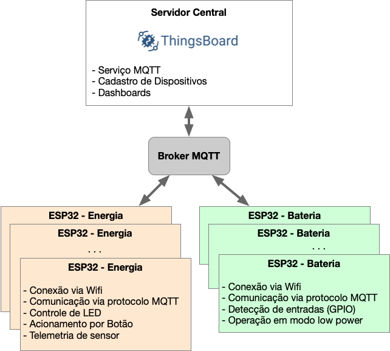
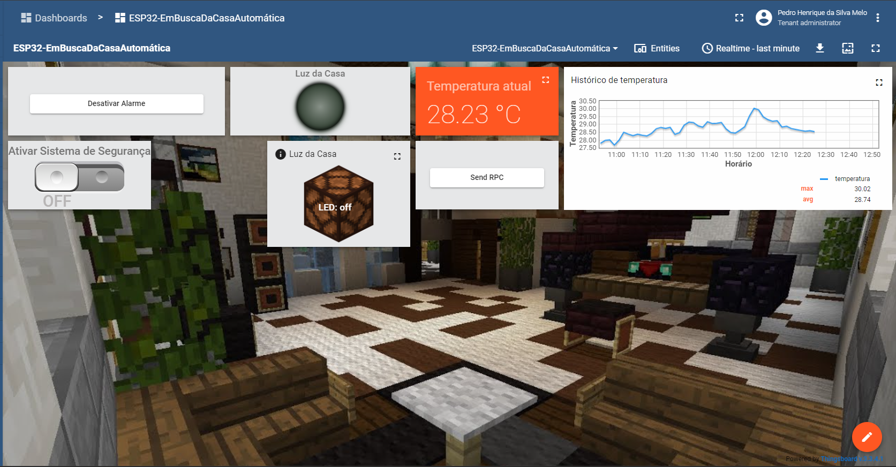

# Trabalho Final (2024-1) - Solução IoT

  
 Enunciado 

# Trabalho Final 2024/1

Este é o trabalho final da disciplina de Fundamentos de Sistemas Embarcados (2024/1). O trabalho final pode ser feito em grupos de 3 ou 4 alunos.

## 1. Objetivos

O objetivo deste trabalho é criar um solução IoT utilizando sensores e atuadores distribuídos baseados nos microcontroladores ESP32 interconectados via Wifi através do protocolo MQTT, podendo ser aplicada em diversos contextos de automação a exemplo das áreas de Automação Residencial, Predial ou Industrial.

Os microcontroladores ESP32 irão controlar a aquisição de dados de sensores, botões e chaves e acionar saídas como leds, buzzers, dentre outras. Haverão dois modos de operação dos dispositivos: **modo energia** que representa o dispositivo ligado à tomada e **modo bateria** que representa o dispositivo que deverá operar em modo de baixo consumo.

Toda a comunicação será feita via rede Wifi com o protocolo MQTT e será provido um servidor central para cadastro e controle dos dispositivos através da plataforma [Thingsboard](https://thingsboard.io).

## 2. Componentes do Sistema

O **Servidor Central - Thingsboard** será composto por:

1. Serviço disponibilizado pelo Laboratório de Software (Lappis);
2. Disponibiliza um Broker MQTT;
3. Serviço de Cadastro, registro e monitoramento de dispositivos;
4. Serviço de criação de Dashboards.

**Cliente ESP32 distribuído - Energia**:

1. Dev-Kit-C ESP32;
2. Botão (Presente na placa);
3. LED (Presente na placa);
4. Sensores a ser escolhido pelos alunos;
5. Sensores de telemetria (Temperatura / Umidade).

**Cliente ESP32 distribuído - Bateria**:

1. Dev-Kit-C ESP32;
2. Botão (Presente na placa);
3. LED (Presente na placa);
4. Sensores a ser escolhido pelos alunos.

## 3. Conexões entre os módulos do sistema

1. A interconexão entre os dispositivos será toda realizada através do Protocolo MQTT via rede Ethernet/Wifi.
2. A rede MQTT será coordenada por um Broker disponível no serviço junto ao Thingsboard;
3. Todas as mensagens via MQTT devem estar no formato JSON;
4. **ESP32**: o botão e o LED a serem usados são os dispositivos já integrados no próprio kit de desenvolimento (Botão = GPIO 0 / LED = GPIO 2);
5. **ESP32**: um conjunto de sensores (analógicos e/ou digitais) serão disponibilizados aos alunos cuja telemetria deve ser implementada e enviada ao Thingsboard;
6. **Servidor Central - Thingsboard**: serão criados usuários para cada aluno/grupo que ficarão reposnsáveis por criar os dispositivos e dashboards necessários para a implementação do trabalho;

## 4. Requisitos

Abaixo estão detalhados os requisitos de cada um dos componentes do sistema.

#### **Servidor Central - Thingsboard**:

1. Serão criadas as contas/usuários para cada aluno/grupo;
2. Cada aluno/grupo será responsável por cadastrar seus dispositivos e gerar os tokens de acesso;
3. Cada aluno/grupo será responsável por criar um dashboard que apresente dados de telemetria e dos atributos dos dispositivos, bem como comandos em tela para acionamento de atuadores (elementos controlados) de cada dispositivos distribuído;

Todo o envio de Telemetria, Atributos e recebimento de comandos para o Thingsboard é documentado da API de referência: [ThingsBoard MQTT API reference](https://thingsboard.io/docs/reference/mqtt-api/).

Cada dispositivo criado no Thingsboard deverá ser configurado com o tipo de transporte (`Tranport Type`) MQTT. A conexão MQTT cujos tópicos para envio de dados são:

- Telemetria: `v1/devices/me/telemetry`
- Atributos: `v1/devices/me/attributes`

O envio e recebimento de comandos deverá ser realizado através de **Remote Procedure Calls (RPC)**, com a documentação descrita na API. Em resumo, o cliente deve se inscrever no tópido `v1/devices/me/rpc/request/+` e irá receber cada comando em um subtópico com `ID` único em `v1/devices/me/rpc/response/$request_id`. Quanto necessário, a confirmação do comando deve ser retornada pelo mesmo tópico com o `ID` enviado (`v1/devices/me/rpc/response/$request_id`). O conteúdo de todas as mensagens será sempre no formato Json.

#### **Cliente ESP32**:

Haverão duas configurações possíveis dos clientes ESP32. A **ESP32-Energia** irá funcionar conectada permanentemente à alimentação e a **ESP32-Bateria** representa um dispositivo operado por baterias (que deve funcionar em modo Low Power). **Atenção**! O firmware para as duas variações deverá ser o mesmo e a opção de funcionamento por um modo ou outro deverá ser definida através de uma variável de ambiente no **_menuconfig_**.

1. O código da ESP32 deve ser desenvolvido em C/C++ utilizando o framework ESP-IDF (Deve ser indicado no README a versão do framework utilizada para o desenvolvimento e se foi feito usando a ESP-IDF nativa ou via PlatformIO);
2. A ESP32 deverá se conectar via Wifi (com as credenciais sendo definidas em variável de ambiente pelo Menuconfig);
3. Cada cliente ESP32, ao ser iniciado pela primeira vez, deve:  
   3.1 Inicializar o serviço MQTT e conectar ao broker com o token de acesso do dispositivo;  
   3.2 Se inscrever no tópico `v1/devices/me/rpc/request/+` para receber comandos remotos;  
   3.3 Enviar telemetria e atributos pelos respectivos tópicos da API;

4. Armazenar o estado dos atributos (estado das saídas) em caso de reinicio do dispositivo por falta de energia. A informação de estado deve ser armzenada na memória não volátil (NVS).
5. Realizar telemetria dos sensores selecionados e atualização do dashboard de maneira periódica (no mínimo a cada 1 segundo);
6. Monitorar o botão utilizando interrupções e enviar por mensagem push a cada mudança do estado do botão;
7. Acionar saídas como o LED, dentre outras, à partir dos comandos RPC enviados pelo Dashboard de maneira dimerizável, sua intensidade sendo controlada à partir da técnica de PWM;

**Observação**: A versão da ESP32 operando por bateria deverá ter as mesmas características de comunicação descritas acima, porém, será utilizada exclusivamente para acionamento de sensores (entradas) operando em modo _low power_ e enviando o estado de seu sensor via push sempre que houver uma mudança de estado. Neste caso, não haverá um sensor de temperatura / umidade acoplado.

## 5. Sensores Obrigatórios

Alguns sensores serão obrigatórios:

1. LED (saídas);
2. Botão (input da ESP32);
3. Tela OLED 0.96;
4. Sensor de temperatura (qualquer sensor digital ou analógico);
5. Pelo menos um sensor com entrada analógica.

## 6. README

A descrição de funcionamento bem como as instruções de como rodar todo o ambiente devem ser inscluidas no README do repositório.

Incluir um **vídeo** de até **10 minutos** demonstrando todo o funcionamento do sistema.

## 7. Critérios de Avaliação

A avaliação será realizada seguindo os seguintes critérios:

| ITEM                                     | DETALHE                                                                                                                                                                                       | VALOR |
| ---------------------------------------- | --------------------------------------------------------------------------------------------------------------------------------------------------------------------------------------------- | :---: |
| **Servidor Central Thingsboard**         |                                                                                                                                                                                               |       |
| **Dashboard**                            | Dashboard criado representando a telemetria e estados dos atributos.                                                                                                                          |  1,0  |
| **Acionamento**                          | Mecanismo RPC para acionamento remoto de atributos dos dispositivos distribuídos.                                                                                                             |  1,0  |
| **Clientes ESP32 - Energia**             |                                                                                                                                                                                               |       |
| **Acionamento de Dispositivos (Saídas)** | Correto acionamento e envio do estado da saída (atuadores, leds, etc.) de acordo com os comandos RPC do Dashboard (incluíndo o acionamento em modo PWM). - **Mínimo de 3 saídas no projeto**. |  1,0  |
| **Leitura das Entradas Digitais**        | Correta detecção e envio do estado da entradas (sensores, botões, etc.) ao servidor central. **Mínimo de 3 entradas no projeto**                                                              |  0,5  |
| **Leitura das Entradas Analógicas**      | Correta leitura e interpretação da grandeza da analógica e envio ao servidor central. **Mínimo de 1 entrada no projeto**                                                                      |  0,5  |
| **Leitura de Telemetria de Sensores**    | Leitura e envio dos valores médios de temperatura / umidade a cada 10 segundos.                                                                                                               |  1,0  |
| **Clientes ESP32 - Bateria**             |                                                                                                                                                                                               |       |
| **Operação em modo Low Power**           | Correta operação da placa em modo _low power_ economizando energia.                                                                                                                           |  1,0  |
| **Acionamento da Entrada**               | Correta detecção e envio do estado da entrada ao servidor central sendo acordado somente no acionamento da GPIO em modo _low power_.                                                          |  0,5  |
| **Geral**                                |                                                                                                                                                                                               |       |
| **NVS**                                  | Armazenamento do estado dos atributos na NVS.                                                                                                                                                 |  1,0  |
| **Comunicação MQTT**                     | Correta implementação de comunicação entre os dispositivos (MQTT e Json).                                                                                                                     |  1,0  |
| **Qualidade do Código**                  | Utilização de boas práticas como o uso de bons nomes, modularização e organização em geral.                                                                                                   |  1,0  |
| **Documentação**                         | Documentação no README e vídeo de apresentação do produto.                                                                                                                                    |  0,5  |
| **Pontuação Extra 1**                    | Qualidade e usabilidade acima da média.                                                                                                                                                       |  0,5  |
| **Pontuação Extra 2**                    | Implementação de mecanismo de fácil acesso para que o usuário possa fazer cadastrar as credenciais do Wifi na ESP32.                                                                          |  0,5  |
| **Pontuação Extra 3**                    | Suporte à OTA na ESP32.                                                                                                                                                                       |  1,0  |

## 7. Referências

[ESP-IDF - Documentação](https://docs.espressif.com/projects/esp-idf/en/latest/esp32/)  
[ESP-IDF - Github](https://github.com/espressif/esp-idf)  
[Thingsboard](https://thingsboard.io)  
[ThingsBoard MQTT API reference](https://thingsboard.io/docs/reference/mqtt-api/)

## 8. Referências dos sensores

[Biblioteca DHT11 para ESP-IDF ESP32](https://github.com/0nism/esp32-DHT11)  
[Joystick KY-023](https://blogmasterwalkershop.com.br/arduino/como-usar-com-arduino-modulo-joystick-ky-023)  
[Sensor de som](https://blogmasterwalkershop.com.br/arduino/como-usar-com-arduino-sensor-detector-de-som-ky-038)  
[Sensor de som sensível](https://blog.eletrogate.com/modulo-sensor-de-som-descricao-e-aplicacoes/)  
[Detector de chama](https://www.filipeflop.com/blog/sensor-de-chama-com-arduino/)  
[Sensor de efeito hall linear](https://www.aranacorp.com/pt/usando-um-sensor-de-efeito-hall-com-arduino/)  
[Sensor de toque](https://blogmasterwalkershop.com.br/arduino/como-usar-com-arduino-sensor-detector-de-toque-ky-036)  
[Sensor de temperatura digital com termistor](https://mundoprojetado.com.br/termistor-ntc/)  
[Buzzer ativo / passivo](https://blogmasterwalkershop.com.br/arduino/como-usar-com-arduino-buzzer-5v-ativo)  
[Buzzer ativo / passivo 2](https://diyi0t.com/active-passive-buzzer-arduino-esp8266-esp32/)  
[LED RGB](https://portal.vidadesilicio.com.br/como-utilizar-o-led-rgb-com-arduino/)  
[LED RG](https://www.criandorobocomarduino.com/2014/07/como-usar-e-testar-o-led-bicolor-com.html)  
[Sensor de batida de coração](https://www.electrofun.pt/blog/como-usar-o-sensor-de-pulsacao-infravermelho-ky-039/)  
[Sensor de choque](https://www.arduinoecia.com.br/sensor-de-vibracao-sw-18010p-arduino/)  
[Codificador rotativo](https://www.arduinoecia.com.br/como-usar-encoder-rotativo-ky-040-arduino/)  
[Sensor de inclinação](https://blogmasterwalkershop.com.br/arduino/como-usar-com-arduino-modulo-sensor-detector-de-inclinacao-ky-020)  
[Sensor de movimento](https://blogmasterwalkershop.com.br/arduino/como-usar-com-arduino-mini-sensor-pir-detector-de-movimento-hc-sr505)  
[Sensor foto resistor LDR](https://portal.vidadesilicio.com.br/sensor-de-luz-com-ldr/)  
[Sensor de efeito hall analógico](https://www.arduinoecia.com.br/sensor-hall-ky-003-arduino/)  
[Sensor de efeito hall magnético](https://blogmasterwalkershop.com.br/arduino/como-usar-com-arduino-sensor-hall-de-campo-magnetico-ky-024)  
[Sensor de temperatura digital DS18B20 (1)](https://www.curtocircuito.com.br/blog/Categoria%20Arduino/como-utilizar-o-ds18b20)  
[Sensor de temperatura digital DS18B20 (2)](https://github.com/DavidAntliff/esp32-ds18b20-example)  
[Tela OLED 0.96" SSD1306](https://github.com/nopnop2002/esp-idf-ssd1306)

 

  
 README entregue 

Repositório para o trabalho final da disciplina de Fundamentos de Sistemas Embarcados durante o semestre 2024/1, este repositório contém 3 projetos ESP-IDF com cada um apresentando uma funcionalidade diferente na temática de Casa Inteligente.

| Matrícula  | Aluno                        |
| ---------- | ---------------------------- |
| 18/0042238 | João Gabriel de Matos        |
| 20/2063300 | João Pedro Rodrigues Morbeck |
| 21/1039662 | Pedro Henrique da Silva Melo |

# Observações Gerais

Esse projeto se conecta com um servidor Thingsboard utilizando o protocolo MQTT e conexão WiFi, para enviar informações de telemetria e atributos, incluindo dados de temperatura em graus Celsius.

Além disso, ele também envia informações de estado de um LED, simulando a luz da casa, e conta com uma forma de desativar o alarme de segurança quando o sistema de segurança estiver ativado a partir de um interruptor.

## Hardware

O hardware para este projeto apresenta 3 ESPS32, com diferentes entradas e saídas expostas abaixo junto com os sensores utilizados:

### ESP1

- Sensor foto resistor LDR (GPIO34) - Entrada Analógica;
- LED Azul da ESP (GPIO2).

### ESP 2

- Sensor de Som - Entrada Digital;
- Buzzer - Saída com PWM;
- LED Azul ESP (GPIO2);
- LED RGB.

### ESP 3

- Tela OLED 0.96;
- Sensor de Temperatura - Entrada Analógica;

# Dependências

[Visual Studio Code](https://code.visualstudio.com/)

[ESP-IDF](https://docs.espressif.com/projects/esp-idf/en/v5.0/esp32/get-started/index.html)

[Thingsboard](https://thingsboard.io/)

## Dispositivos ThingsBoard

- ESP32-PedroHenriqueSilvaMelo
- ESP32-JoãoGabrielMatos
- ESP32-JoãoPedroMorbeck

## Como rodar

Para rodar o projeto, é necessário executar os seguintes comandos para cada ESP:

1. Atualize as credenciais wifi com o menuconfig

   `idf.py menuconfig`

2. Compile os códigos-fonte

   `build`

3. Grave o resultado na memória _flash_ da ESP32

   `flash`

4. Execute e monitore

   `monitor`

# Dashboard

Abaixo está um imagem do dashboard do Thingsboard com os dados enviados pelo projeto.

- [link](http://thingsboard.lappis.rocks:443/dashboards/64ada330-662c-11ef-b837-251c88993eff) para o DashBoard no ThingsBoard

 

| ITEM                                     | DETALHE                                                                                                                                                                                       | VALOR | Nota | Observações                     |
| ---------------------------------------- | --------------------------------------------------------------------------------------------------------------------------------------------------------------------------------------------- | :---: | ---- | ------------------------------- |
| **Servidor Central Thingsboard**         |                                                                                                                                                                                               |       |      |                                 |
| **Dashboard**                            | Dashboard criado representando a telemetria e estados dos atributos.                                                                                                                          |  1,0  | 1,0  | Ok, funcionando                 |
|                                          |
| **Acionamento**                          | Mecanismo RPC para acionamento remoto de atributos dos dispositivos distribuídos.                                                                                                             |  1,0  | 1,0  | Ok, implementado e funcionando. |
|                                          |
| **Clientes ESP32 - Energia**             |                                                                                                                                                                                               |       |      |                                 |
| **Acionamento de Dispositivos (Saídas)** | Correto acionamento e envio do estado da saída (atuadores, leds, etc.) de acordo com os comandos RPC do Dashboard (incluíndo o acionamento em modo PWM). - **Mínimo de 3 saídas no projeto**. |  1,0  | 1,0  | OLED. LED. Buzzer               |
|                                          |
| **Leitura das Entradas Digitais**        | Correta detecção e envio do estado da entradas (sensores, botões, etc.) ao servidor central. **Mínimo de 3 entradas no projeto**                                                              |  0,5  | 0,5  | Som                             |
| **Leitura das Entradas Analógicas**      | Correta leitura e interpretação da grandeza da analógica e envio ao servidor central. **Mínimo de 1 entrada no projeto**                                                                      |  0,5  | 0,5  | Temperatura NTC + LDR           |
| **Leitura de Telemetria de Sensores**    | Leitura e envio dos valores médios de temperatura / umidade a cada 10 segundos.                                                                                                               |  1,0  | 1,0  | Temperatura                     |
| **Clientes ESP32 - Bateria**             |                                                                                                                                                                                               |       |      |                                 |
| **Operação em modo Low Power**           | Correta operação da placa em modo _low power_ economizando energia.                                                                                                                           |  1,0  | 0,5  | Modo sleep com alguns erros     |
| **Acionamento da Entrada** | Correta detecção e envio do estado da entrada ao servidor central sendo acordado somente no acionamento da GPIO em modo _low power_. | 0,5 | 0.5 | Ok|
| **Geral** | | | | |
| **NVS** | Armazenamento do estado dos atributos na NVS. | 1,0 | 1,0 | Estado do sistema de segurança sendo salvo e lido no NVS |
| **Comunicação MQTT** | Correta implementação de comunicação entre os dispositivos (MQTT e Json). | 1,0 | 1,0 | Ok, funcionando entre as ESPs
|
| **Qualidade do Código** | Utilização de boas práticas como o uso de bons nomes, modularização e organização em geral. | 1,0 | 0,7 | Não há padronização das soluções. Cada código de cada ESP está diferente. A implementação do MQTT está diferente em cada uma. Algumas com tudo funcionando e outras sem o uso da recepção de mensagens |
| **Documentação** | Documentação no README e vídeo de apresentação do produto. | 0,5 | 0,5 | Documentação OK
|
| **Pontuação Extra 1** | Qualidade e usabilidade acima da média. | 0,5 | | |
| **Pontuação Extra 2** | Implementação de mecanismo de fácil acesso para que o usuário possa fazer cadastrar as credenciais do Wifi na ESP32. | 0,5 | | |
| **Pontuação Extra 3** | Suporte à OTA na ESP32. | 1,0 | | |
|Total||12,0|9,2||

